# D'Agriventory Entity-Relationship Diagram

This document provides a comprehensive view of the D'Agriventory database schema, illustrating the relationships between all entities in the system.

## Overview

The D'Agriventory database is designed around three core inventory management systems used by the Department of Agriculture - Cordillera Administrative Region:

- **ICS (Inventory Custodian Slip)**: For tracking semi-expendable property with high value (SPHV) and low value (SPLV)
- **PAR (Property Acknowledgment Receipt)**: For tracking property assignments with location codes
- **IDR (Inventory and Inspection of Deliveries and Receipts)**: For managing consumable inventory with draw-down tracking

## Key Design Principles

- **Soft Deletes**: Most entities support soft deletion to prevent permanent data loss
- **Audit Trail**: Comprehensive logging of all system changes
- **Role-Based Access**: Clear separation between admin users and division inventory managers
- **Procurement Tracking**: Full traceability from suppliers through contracts to inventory items

## Database Schema

> **Alternative Visualization**: For a more detailed and interactive view of the database schema, you can also view the [`erd.drawio.svg`](./erd.drawio.svg) file, which can be opened in [draw.io](https://app.diagrams.net/) for editing or viewed directly in any SVG-compatible viewer.

```mermaid
erDiagram
    %% ========================================================================
    %% USER MANAGEMENT & AUTHENTICATION
    %% ========================================================================
    
    users {
        bigint id PK "Primary key"
        varchar name "Full name of the user"
        varchar username UK "Unique username for login"
        varchar email UK "Unique email address"
        varchar password "Encrypted password hash"
        varchar remember_token "nullable - Remember me token"
        timestamp email_verified_at "nullable - Email verification timestamp"
        timestamp created_at "Record creation timestamp"
        timestamp updated_at "Record last update timestamp"
    }
    
    admin_users {
        bigint id PK "Primary key"
        bigint user_id FK "Links to users table"
        varchar role "default: admin - Admin role type"
        json permissions "nullable - Custom permission sets"
        boolean is_active "default: true - Account status"
        timestamp last_login_at "nullable - Last login timestamp"
        timestamp created_at "Record creation timestamp"
        timestamp updated_at "Record last update timestamp"
    }
    
    division_inventory_managers {
        bigint id PK "Primary key"
        bigint user_id FK "Links to users table"
        bigint division_id FK, UK "One manager per division - Links to divisions"
        timestamp created_at "Record creation timestamp"
        timestamp updated_at "Record last update timestamp"
    }

    %% ========================================================================
    %% ORGANIZATIONAL STRUCTURE
    %% ========================================================================
    
    employees {
        bigint id PK "Primary key"
        varchar name "Full name of the employee"
        bigint division_id FK "nullable - Employee's division assignment"
        varchar position_title "nullable - Position title (e.g., IT Officer, Chief Accountant)"
        varchar position_code "nullable - Position code/abbreviation"
        enum position_type "nullable - DIVISION_CHIEF, COORDINATOR, FOCAL_PERSON, OFFICER, SPECIALIST, OTHER"
        text position_description "nullable - Position description and responsibilities"
        timestamp created_at "Record creation timestamp"
        timestamp updated_at "Record last update timestamp"
        timestamp deleted_at "nullable - Soft delete timestamp"
    }
    
    divisions {
        bigint id PK "Primary key"
        varchar name UK "Division or office name"
        varchar code UK "Unique division code"
        timestamp created_at "Record creation timestamp"
        timestamp updated_at "Record last update timestamp"
        timestamp deleted_at "nullable - Soft delete timestamp"
    }
    


    %% ========================================================================
    %% PROCUREMENT & SUPPLIERS
    %% ========================================================================
    
    suppliers {
        bigint id PK "Primary key"
        varchar name UK "Supplier/vendor name"
        timestamp created_at "Record creation timestamp"
        timestamp updated_at "Record last update timestamp"
        timestamp deleted_at "nullable - Soft delete timestamp"
    }
    
    contracts {
        bigint id PK "Primary key"
        bigint supplier_id FK "Links to suppliers table"
        varchar contract_po_ib_number UK "Unique contract/PO/IB number"
        timestamp created_at "Record creation timestamp"
        timestamp updated_at "Record last update timestamp"
        timestamp deleted_at "nullable - Soft delete timestamp"
    }

    %% ========================================================================
    %% ITEM CATALOG & CATEGORIZATION
    %% ========================================================================
    
    primary_categories {
        bigint id PK "Primary key"
        varchar name UK "Primary category name"
        varchar code UK "Unique category code"
        text description "nullable - Category description"
        timestamp created_at "Record creation timestamp"
        timestamp updated_at "Record last update timestamp"
        timestamp deleted_at "nullable - Soft delete timestamp"
    }
    
    secondary_categories {
        bigint id PK "Primary key"
        bigint primary_category_id FK "Links to primary_categories"
        varchar name UK "Secondary category name"
        varchar code UK "Unique subcategory code"
        text description "nullable - Subcategory description"
        timestamp created_at "Record creation timestamp"
        timestamp updated_at "Record last update timestamp"
        timestamp deleted_at "nullable - Soft delete timestamp"
    }
    
    items_catalog {
        bigint id PK "Primary key"
        varchar name UK "Generic item name"
        varchar unit "Unit of measure (pcs, kg, liters, etc.)"
        bigint secondary_category_id FK "Links to secondary_categories"
        varchar code UK "Universal item code"
        timestamp created_at "Record creation timestamp"
        timestamp updated_at "Record last update timestamp"
        timestamp deleted_at "nullable - Soft delete timestamp"
    }
    
    item_specifications {
        bigint id PK "Primary key"
        bigint item_catalog_id FK "Links to items_catalog"
        varchar brand "nullable - Item brand name"
        varchar model "nullable - Item model number"
        text detailed_specifications "nullable - Detailed technical specs"
        timestamp created_at "Record creation timestamp"
        timestamp updated_at "Record last update timestamp"
        timestamp deleted_at "nullable - Soft delete timestamp"
    }
    
    contract_items {
        bigint id PK "Primary key"
        bigint contract_id FK "Links to contracts table"
        bigint item_specification_id FK "Links to item_specifications"
        decimal unit_price "Price per unit for this item"
        enum item_type "ICS, PAR, IDR - Inventory system type"
        timestamp created_at "Record creation timestamp"
        timestamp updated_at "Record last update timestamp"
    }

    %% ========================================================================
    %% ICS (INVENTORY CUSTODIAN SLIP) SYSTEM
    %% ========================================================================
    
    ics_number {
        bigint id PK "Primary key"
        varchar ics_number UK "Unique ICS document number"
        bigint assigned_employee_id FK "Employee assigned this property"
        bigint contract_item_id FK "Source contract item"
        enum ics_type "SPLV (Semi-expendable Property Low Value) or SPHV (High Value)"
        int quantity "Quantity assigned in this ICS"
        int estimated_useful_life "Expected lifespan in years"
        date date_prepared "When ICS document was prepared"
        date date_accepted "When employee accepted the property"
        text remarks "nullable - Additional notes or comments"
        timestamp created_at "Record creation timestamp"
        timestamp updated_at "Record last update timestamp"
    }
    
    ics_item_batches {
        bigint id PK "Primary key"
        bigint ics_number_id FK "Links to ics_number"
        text identification_data "nullable - Serial numbers, asset tags, etc."
        timestamp created_at "Record creation timestamp"
        timestamp updated_at "Record last update timestamp"
    }
    
    item_components {
        bigint id PK "Primary key"
        bigint ics_item_batch_id FK "Links to ics_item_batches"
        varchar component_type "Component type (Monitor, CPU, UPS, etc.)"
        varchar brand "nullable - Component brand"
        varchar model "nullable - Component model"
        varchar serial_number "nullable - Component serial number"
        timestamp created_at "Record creation timestamp"
        timestamp updated_at "Record last update timestamp"
    }
    
    ics_transfers {
        bigint id PK "Primary key"
        bigint ics_number_id FK "ICS being transferred"
        bigint from_employee_id FK "Employee transferring the property"
        bigint to_employee_id FK "Employee receiving the property"
        date transfer_date "Date of property transfer"
        timestamp created_at "Record creation timestamp"
        timestamp updated_at "Record last update timestamp"
    }

    %% ========================================================================
    %% PAR (PROPERTY ACKNOWLEDGMENT RECEIPT) SYSTEM
    %% ========================================================================
    
    par_number {
        bigint id PK "Primary key"
        varchar par_number UK "Unique PAR document number"
        bigint assigned_employee_id FK "Employee assigned this property"
        bigint contract_item_id FK "Source contract item"
        int quantity "Quantity assigned in this PAR"
        varchar area_code "Area location code"
        varchar building_code "Building location code"
        varchar account_code "Accounting classification code"
        date date_prepared "When PAR document was prepared"
        date date_accepted "When employee accepted the property"
        text remarks "nullable - Additional notes or comments"
        timestamp created_at "Record creation timestamp"
        timestamp updated_at "Record last update timestamp"
    }
    
    par_item_batches {
        bigint id PK "Primary key"
        bigint par_number_id FK "Links to par_number"
        text identification_data "nullable - Serial numbers, asset tags, etc."
        timestamp created_at "Record creation timestamp"
        timestamp updated_at "Record last update timestamp"
    }
    
    par_transfers {
        bigint id PK "Primary key"
        bigint par_number_id FK "PAR being transferred"
        bigint from_employee_id FK "Employee transferring the property"
        bigint to_employee_id FK "Employee receiving the property"
        date transfer_date "Date of property transfer"
        timestamp created_at "Record creation timestamp"
        timestamp updated_at "Record last update timestamp"
    }

    %% ========================================================================
    %% IDR (INVENTORY DELIVERY RECEIPT) SYSTEM
    %% ========================================================================
    
    idr_number {
        bigint id PK "Primary key"
        int number UK "Sequential IDR/RSMI number"
        bigint assigned_employee_id FK "Supply Officer responsible for stock"
        bigint approving_employee_id FK "Division Chief who approves IDR"
        bigint contract_item_id FK "Source contract item"
        int quantity "Initial total quantity in this batch"
        varchar inventory_code "IDR-specific inventory classification"
        varchar ors "Obligation Request and Status number"
        date date_prepared "When IDR document was prepared"
        date date_accepted "When IDR was officially accepted"
        text remarks "nullable - Additional notes or comments"
        timestamp created_at "Record creation timestamp"
        timestamp updated_at "Record last update timestamp"
    }
    
    idr_item_batches {
        bigint id PK "Primary key"
        bigint idr_number_id FK "Links to idr_number"
        text identification_data "nullable - Serial numbers, batch codes, etc."
        timestamp created_at "Record creation timestamp"
        timestamp updated_at "Record last update timestamp"
    }
    
    acknowledgement_receipts {
        bigint id PK "Primary key"
        bigint idr_item_batch_id FK "IDR batch being drawn from"
        int quantity_reduced "Quantity taken in this transaction"
        timestamp created_at "Record creation timestamp"
        timestamp updated_at "Record last update timestamp"
    }

    %% ========================================================================
    %% CONSUMABLES MANAGEMENT
    %% ========================================================================
    
    consumable_records {
        bigint id PK "Primary key"
        varchar record_number UK "Unique record number for this batch"
        bigint division_id FK "Division that owns this consumable stock"
        date date_received "Date consumables were received"
        text remarks "nullable - Additional notes about the batch"
        timestamp created_at "Record creation timestamp"
        timestamp updated_at "Record last update timestamp"
    }
    
    consumable_items {
        bigint id PK "Primary key"
        bigint consumable_record_id FK "Links to consumable_records"
        bigint item_specification_id FK "Specific item details"
        int initial_quantity "Original quantity received"
        int current_quantity "Current remaining quantity"
        timestamp created_at "Record creation timestamp"
        timestamp updated_at "Record last update timestamp"
    }

    %% ========================================================================
    %% AUDIT & LOGGING
    %% ========================================================================
    
    audit_logs {
        bigint id PK "Primary key"
        bigint user_id FK "nullable - User who performed the action"
        varchar table_name "Database table affected"
        bigint record_id "ID of the affected record"
        varchar action_type "CREATE, UPDATE, DELETE, etc."
        json old_values "nullable - Record state before change"
        json new_values "nullable - Record state after change"
        text description "nullable - Human-readable action description"
        timestamp created_at "When the action occurred"
    }

    %% ========================================================================
    %% RELATIONSHIPS
    %% ========================================================================
    
    %% User Management Relationships
    users ||--o| admin_users : "can be"
    users ||--o| division_inventory_managers : "can be"
    divisions ||--o| division_inventory_managers : "is managed by"
    
    %% Organizational Relationships
    divisions ||--o{ employees : "employs"
    
    %% Catalog Relationships
    primary_categories ||--o{ secondary_categories : "contains"
    secondary_categories ||--o{ items_catalog : "categorizes"
    items_catalog ||--o{ item_specifications : "has variants"
    
    %% Procurement Relationships
    suppliers ||--o{ contracts : "supplies under"
    contracts ||--o{ contract_items : "contains"
    item_specifications ||--o{ contract_items : "specified in"
    
    %% ICS System Relationships
    employees ||--o{ ics_number : "is assigned"
    contract_items ||--o{ ics_number : "sourced from"
    ics_number ||--o{ ics_item_batches : "contains"
    ics_item_batches ||--o{ item_components : "has"
    ics_number ||--o{ ics_transfers : "transferred via"
    employees ||--o{ ics_transfers : "transfers from"
    employees ||--o{ ics_transfers : "transfers to"
    
    %% PAR System Relationships
    employees ||--o{ par_number : "is assigned"
    contract_items ||--o{ par_number : "sourced from"
    par_number ||--o{ par_item_batches : "contains"
    par_number ||--o{ par_transfers : "transferred via"
    employees ||--o{ par_transfers : "transfers from"
    employees ||--o{ par_transfers : "transfers to"
    
    %% IDR System Relationships
    employees ||--o{ idr_number : "is assigned to"
    employees ||--o{ idr_number : "approves"
    contract_items ||--o{ idr_number : "sourced from"
    idr_number ||--o{ idr_item_batches : "contains"
    idr_item_batches ||--o{ acknowledgement_receipts : "drawn down by"
    
    %% Consumables Relationships
    divisions ||--o{ consumable_records : "owns"
    consumable_records ||--o{ consumable_items : "details"
    item_specifications ||--o{ consumable_items : "specifies"
    
    %% Audit Relationships
    users ||--o{ audit_logs : "performed action"
```

## Entity Explanations

### User Management
- **users**: Core authentication table storing login credentials
- **admin_users**: Extends users with administrative privileges and custom permissions
- **division_inventory_managers**: Links users to specific divisions they manage

### Organizational Structure
- **employees**: Staff records independent of system users, with position information stored inline and soft delete support
- **divisions**: Organizational units (departments, offices) within DA-CAR

### Procurement Chain
- **suppliers**: Vendors and contractors providing goods/services
- **contracts**: Purchase orders, contracts, and procurement agreements
- **contract_items**: Specific items within each contract with pricing

### Item Catalog System
- **primary_categories**: Top-level item classifications
- **secondary_categories**: Sub-classifications within primary categories  
- **items_catalog**: Master list of all items with units of measure
- **item_specifications**: Detailed specs, brands, and models for catalog items

### ICS (Inventory Custodian Slip) System
- **ics_number**: Main ICS records for semi-expendable property
- **ics_item_batches**: Groups of items within an ICS
- **item_components**: Individual components of complex items (e.g., computer parts)
- **ics_transfers**: Property transfers between employees

### PAR (Property Acknowledgment Receipt) System
- **par_number**: Main PAR records with location coding
- **par_item_batches**: Groups of items within a PAR
- **par_transfers**: Property transfers between employees

### IDR (Inventory Delivery Receipt) System
- **idr_number**: Main IDR records for consumable inventory
- **idr_item_batches**: Batches of consumable items
- **acknowledgement_receipts**: Draw-down transactions reducing IDR quantities

### Consumables Management
- **consumable_records**: Division-owned consumable stock batches
- **consumable_items**: Specific consumable items with quantity tracking

### System Auditing
- **audit_logs**: Comprehensive change tracking for all system operations

## Key Features

1. **Soft Deletes**: Prevents permanent data loss on critical entities
2. **Full Traceability**: Complete chain from supplier → contract → item → assignment
3. **Component Tracking**: Detailed tracking of item components for complex equipment
4. **Transfer History**: Complete audit trail of property transfers
5. **Quantity Management**: Real-time tracking of consumable quantities
6. **Role-Based Data**: Clear separation between admin and division-level data access 